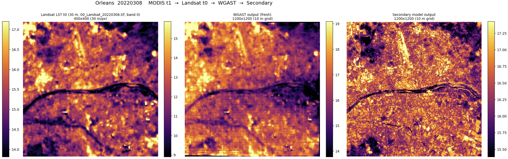

<h1 align="center">WGAST Day-Ahead LST Forecaster</h1>
<p align="center"><em>A secondary model that imitates WGAST to predict 10&nbsp;m Land Surface Temperature one day ahead.</em></p>

<div align="center">
<a href="https://arxiv.org/abs/2508.06485" target="_blank"></a>
<a href="https://github.com/Sofianebouaziz1/WGAST" target="_blank"></a>
</div>

> **This is a research / hobby fork, not the official WGAST.** All credit for the
> WGAST model, method, and results belongs to its original authors (see
> [Attribution](#attribution--original-wgast)). What *I* added here is a small
> **secondary model** that learns to mimic WGAST so it can make a **one-day-ahead**
> prediction. For the canonical WGAST, always use the
> [original repository](https://github.com/Sofianebouaziz1/WGAST) and
> [paper](https://arxiv.org/abs/2508.06485).

---

## Attribution — original WGAST

**WGAST** — *Weakly-Supervised Generative Network for Daily 10&nbsp;m Land Surface
Temperature Estimation via Spatio-Temporal Fusion* — was developed by
**Sofiane Bouaziz, Adel Hafiane, Raphaël Canals, and Rachid Nedjai**
([arXiv:2508.06485](https://arxiv.org/abs/2508.06485)).

WGAST is a conditional-GAN that fuses Terra MODIS (1&nbsp;km), Landsat&nbsp;8
(30&nbsp;m), and Sentinel-2 (10&nbsp;m) into a daily **10&nbsp;m Land Surface
Temperature (LST)** map, trained with weak supervision against 30&nbsp;m
Landsat-derived LST. This repository started as a fork of their code.

**Two honest caveats about the WGAST used here:**

1. **The pretrained WGAST weights were never published.** So in this project I
   **retrained WGAST from scratch myself, without any fine-tuning** against the
   authors' checkpoint. My WGAST is therefore weaker than, and may differ from,
   the model in the paper.
2. **This codebase has been altered** from the original (added pipeline, renamed
   files, fixes). It is **not** a faithful copy of the authors' release.

If you want the real WGAST, go to the [original repo](https://github.com/Sofianebouaziz1/WGAST)
and [paper](https://arxiv.org/abs/2508.06485) — not this fork.

---

## What I tried to do

WGAST can only produce an LST map for **day-0**: it needs cloud-free satellite
observations on the day you want a map for. That makes it useless for
*forecasting* — you can't observe tomorrow's clear-sky satellite scene today.

So I built a **secondary model that imitates WGAST**: a single neural network
trained as a **WGAST surrogate**. It looks at what WGAST *would* have seen over
the preceding days plus weather, and predicts the WGAST raster **one day ahead**,
**without needing any satellite observation on the prediction day**.

**Goal / use case:** a **day-ahead urban-heat-island warning at 10&nbsp;m**.
A 10&nbsp;m map lets you flag the specific streets, blocks, and parks that will
be hottest *tomorrow* — not just a citywide average.

---

## How it works (the short version)

The trick is **distillation + a window shift**. Every clear-sky day where WGAST
runs becomes a training example whose **target is WGAST's own output** for that
day. The surrogate never sees the target day's satellite scene — only the
**10 days before it**.

```text
TRAINING     features over d-10 .. d-1   ──►   WGAST raster on day d0
INFERENCE    features over d-9  .. d0     ──►   predicted WGAST raster on day d+1
```

Because the offset between "last feature day" and "predicted day" is always **+1**,
the model trained on the past works unchanged at inference time — and the
prediction day (`d+1`) can be fully cloudy, since nothing is read from it.

---

## The secondary model

> The notebooks and `.py` modules under `tutorials/` are the **source of truth**
> for everything below; this section just describes what they do.

### Inputs

**Spatial branch — 91 channels at the WGAST 10&nbsp;m grid.** For each of the
10 days in the window (`d-10 .. d-1`):

- Sentinel-2 indices (3 bands: NDVI, NDWI, NDBI)
- Landsat-8 indices (3 bands, the non-LST ones, upsampled to 10&nbsp;m)
- a per-day **optical mask** (1 = valid pixel, 0 = cloudy / no acquisition)
- the **past WGAST output** for that day (1 band; zeros if WGAST didn't run)
- a per-day **WGAST mask** (1 if a WGAST output exists that day)

→ `10 × (3 + 3 + 1 + 1 + 1) = 90` channels, plus **1 static DEM** channel = **91**.
Missing/cloudy pixels are zero-filled; the mask channels tell the model what's
real. Slot position encodes recency (the `d-1` slot is always in the same place).

**Scalar branch (conditioning).** Fed into the bottleneck through a small MLP:

- daily Open-Meteo weather (17 variables × 10 days)
- a target-day weather **forecast** block (15 variables — at inference this is
  the live `d+1` forecast)
- season: `sin`/`cos` of the day-of-year
- a region-level **elevation** scalar (mean DEM)

**Deliberately excluded** so generalisation is by design: city id, climate zone,
latitude/longitude, and raw MODIS/Landsat LST. The LST signal reaches the model
**only** through WGAST's own past outputs.

### Target

The **real WGAST raster on day `d0`** — i.e. the surrogate is distilling WGAST,
not predicting ground-truth temperature.

### Architecture

A **conditional U-Net** (`tutorials/model_unet.py`): 4-level encoder/decoder with
skip connections, `GroupNorm`, and the scalar MLP concatenated at the bottleneck.
The decoder outputs a single-channel 10&nbsp;m LST raster.

### Training approach

| Setting | Value |
|---|---|
| Loss | `L1 + 0.1·(1 − SSIM)` (`tutorials/losses.py`) |
| Optimiser | AdamW, lr `1e-3`, cosine-annealing schedule |
| Epochs | 50, checkpoint on **best validation L1** |
| Augmentation | random **256×256 tiles** (same crop across all channels + target) |
| Normalisation | per-channel z-score over *valid* pixels only; missing stays 0 |
| Evaluation | run on the **full raster** (tiles only used for training) |

### Splits — city-based, never random

Cross-city generalisation *is* the claim, so validation and test are cities the
model never trains on (`tutorials/cities.py::EXPERIMENT`):

| Split | City | Why |
|---|---|---|
| **Train** | Istanbul + Orléans (2022) | fitting; Orléans is WGAST's own training city |
| **Val** | Rome (Apr + Sep 2022) | checkpoint selection on an unseen city |
| **Test** | Cairo (Apr + Sep 2022) | held-out desert-climate stress test |

### Baselines & metrics

The model has to beat **persistence** — "tomorrow's map = the most recent WGAST
map in the window." Metrics are computed in physical LST units against the real
WGAST raster: **RMSE, MAE, Bias, PSNR, SSIM**.

---

## Pipeline

Per city, run in order (set the city switch at the top of each):

| Step | File | Does |
|---|---|---|
| 1 | `tutorials/01s_get_training_days.ipynb` | download per-day MODIS/Landsat/Sentinel + DEM + weather |
| 2 | `tutorials/02s_wgast_outputs.ipynb` | run WGAST on every clear-sky day → raster cache |
| 3 | `tutorials/03s_build_dataset.ipynb` | assemble the 91-channel window samples + scalars, fit stats |
| 4 | `tutorials/04s_train.ipynb` | train the conditional U-Net |
| 5 | `tutorials/05s_evaluate.ipynb` | RMSE/MAE/Bias/PSNR/SSIM vs. persistence |
| 6 | `tutorials/06s_compare_wgast_secondary.ipynb` | visual WGAST-vs-surrogate comparison |

Library modules (imported by the notebooks): `cities.py`, `get_Opene_Meteo.py`
(Open-Meteo client), `dataset.py`, `model_unet.py`, `losses.py`. All weather,
forecasts, and sanity-checks come from **Open-Meteo** (Archive + Historical
Forecast APIs).

The original WGAST code it builds on is untouched in spirit and lives in
`data_download/`, `data_preparation/`, `data_loader/`, `model/`, `runner/`, and
tutorials `01_`–`04_`.

---

## Results

Below: Orléans, 2022-03-06 — the 30&nbsp;m Landsat LST, WGAST's own 10&nbsp;m
output, and my secondary model's 10&nbsp;m output side by side. The surrogate
reproduces WGAST's fine spatial structure (the river, the warm built-up areas,
the cool vegetated patches) well.



**Quantitatively, this is a quick first result, reported honestly.** On the
held-out city (Rome, 27 days), the surrogate currently **ties the persistence
baseline** (mean RMSE ≈ 5.06 LST units, essentially equal). In other words, it
has learned to reproduce WGAST's spatial pattern but does not yet *beat* "just
reuse the last map." See my notes below for why — and why I think there's a lot
of headroom.

---

## My notes & future work

This was a **quick test**, not a tuned system. Things I would do with more time:

- **Invest much more in training.** I did essentially no hyperparameter search —
  no sweeps on learning rate, schedule, loss weighting, or tile size.
- **The model may be too big for the data I have.** With only a few dozen
  clear-sky days per city, the U-Net is likely over-parameterised; a smaller
  model (or much more data) would probably help.
- **Try a longer feature time window.** The current 10-day window might be too
  short to capture the relevant thermal/weather history; widening it could lift
  accuracy.
- **WGAST itself was retrained from scratch without fine-tuning** (the original
  weights aren't published), so my target signal is imperfect. Better WGAST
  targets would directly improve the surrogate.

Overall I'm convinced the core idea is sound: with more time and tuning, this
could become a genuine **local, day-ahead pre-heat warning** at street level for
urban heat islands, built on top of WGAST.

---

## A note on AI assistance

I used AI (Anthropic's Claude) **throughout this project**, mainly for the
**coding** and for **designing the secondary model's architecture**. The research
direction, goals, experiments, and all decisions are mine; the AI was a tool.

---

## Requirements

```bash
pip install -r requirements.txt
```

PyTorch, rasterio, earthengine-api/geemap (data download), pandas + pyarrow,
and the Open-Meteo client (`openmeteo-requests`). See `requirements.txt`.

> Large artifacts (rasters, `.npz` samples, model checkpoints) are git-ignored —
> they are all rebuildable by re-running the pipeline above.

---

## Contributors

- **Ichsan** — project, research direction, pipeline, training and evaluation.
- **Claude (Anthropic)** — coding assistance and secondary-model architecture
  design.

Original WGAST model & method: **Sofiane Bouaziz, Adel Hafiane, Raphaël Canals,
Rachid Nedjai**.

---

## How to cite WGAST

If you use WGAST in your research, please cite the original authors:

```bibtex
@article{bouaziz2025wgast,
  title={WGAST: Weakly-Supervised Generative Network for Daily 10 m Land Surface Temperature Estimation via Spatio-Temporal Fusion},
  author={Bouaziz, Sofiane and Hafiane, Adel and Canals, Rapha{\"e}l and Nedjai, Rachid},
  journal={arXiv preprint arXiv:2508.06485},
  year={2025}
}
```
